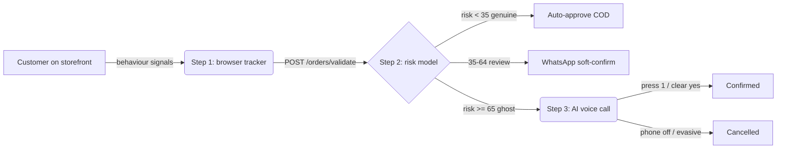

# 👻 Ghost Shopper Detector

**A next-generation anti-RTO / fake-COD detector that scores buyer *intent* in
real time — not just past history.**

Traditional RTO (Return-To-Origin) tools only check whether a phone number has
bounced before. That fails the moment a fraudster switches SIM, name, or email.
The Ghost Shopper Detector instead reads **live behavioural intent** on the
storefront, scores it with an ML model, and — only for genuinely risky orders —
places an **AI voice call** to confirm before the parcel ever ships.

> *"Goes beyond traditional RTO history checking. It uses behavioural
> fingerprinting (scroll speed, hesitation, device reuse) and instant AI voice
> validation to eliminate fake COD orders."*

---

## How it works

```
   ┌─────────────────────────┐        ┌──────────────────────────┐        ┌─────────────────────────┐
   │  STEP 1 — Browser        │        │  STEP 2 — Risk API        │        │  STEP 3 — Voice-bot     │
   │  behaviour tracker       │        │  FastAPI + scikit-learn   │        │  Twilio / Bland AI      │
   │                          │        │                           │        │                         │
   │ • time on page           │ signals│ • logistic-reg model      │ ghost  │ • human-voice call      │
   │ • scroll / hesitation    │──────► │ • risk 0–100              │──────► │ • "1 dabayein…"         │
   │ • size/desc interaction  │        │ • verdict + action        │        │ • keypress + tone check │
   │ • device fingerprint     │        │                           │        │ • confirm / cancel      │
   │ • same-device reuse      │        │                           │        │                         │
   └─────────────────────────┘        └──────────────────────────┘        └─────────────────────────┘
                                                  │
                          risk < 35  → auto-approve (dispatch COD)
                          35 – 64    → WhatsApp soft-confirm
                          risk ≥ 65  → voice validation (Step 3)
```



---

## The three parts

### Step 1 — Behaviour tracker (`ghost-shopper-demo.html`)
A self-contained, zero-dependency page that mimics a Shopify/D2C product page
and tracks the customer as they browse:

- time on page, scroll depth, whether the description/size chart were opened,
  mouse movement, keystroke timing, paste events;
- a **device fingerprint** (canvas + `navigator`) with cross-session **reuse
  detection**, so the same phone ordering under different names/emails is caught
  even when the phone number changes.

Scores in-browser by default; tick **"Use live backend API"** to send signals
to Step 2. Includes **genuine/ghost replay buttons** for demos.

### Step 2 — Risk API (`risk_api/`)
FastAPI service with a calibrated **logistic-regression** model (scikit-learn).
`POST /score` or `POST /orders/validate` returns a **risk 0–100**, a verdict
(`genuine` / `review` / `ghost`), an action, and human-readable top factors.

### Step 3 — AI voice-bot (`risk_api/voice_bot.py`)
For `ghost`-band orders, places an automated human-sounding call:

> "Hello Rahul ji, aapne Urbanicindia se Tan Jutti order ki hai… Confirm karne
> ke liye 1 dabayein."

The response is judged by keypress **and** speech tone (evasive/joking words or
a switched-off phone → cancel). Provider-agnostic: **mock** (offline),
**Twilio** (TwiML), or **Bland AI**.

---

## Quick start

```bash
# Step 2 + 3 — the backend
cd risk_api
pip install -r requirements.txt
python train_model.py            # trains model.joblib (ROC-AUC ~0.90)
uvicorn app:app --port 8000      # http://127.0.0.1:8000/docs

# See the whole voice flow end-to-end, no Twilio needed:
python simulate_voice_flow.py

# Step 1 — open the tracker in a browser
#   open ghost-shopper-demo.html  (tick "Use live backend API" to hit :8000)
```

See [`risk_api/README.md`](risk_api/README.md) for API details, endpoints, and
how to wire real Twilio/Bland credentials.

---

## Repo layout

```
ghost-shopper-demo.html      Step 1 — behaviour tracker (open in a browser)
risk_api/
├── features.py              shared feature schema (train == serve)
├── train_model.py           Step 2 — trains the risk model
├── app.py                   Step 2+3 — FastAPI: /score, /orders/validate, /voice/*
├── voice_bot.py             Step 3 — call script, response analysis, providers
├── simulate_voice_flow.py   offline end-to-end demo of the voice flow
├── requirements.txt
└── README.md
```

---

## From demo to production

- Replace the synthetic training data in `train_model.py` with your real order
  history labelled by outcome (delivered vs RTO) — the pipeline is unchanged.
- Persist device fingerprints server-side (Redis/Postgres) so reuse is counted
  across users and can't be cleared from the browser.
- Add auth + rate limiting before exposing the API publicly.
- Set `VOICE_PROVIDER=twilio` (or `bland`) + credentials to place real calls.

> This is a portfolio / MVP demo. The scoring here is trained on **synthetic**
> data to illustrate the approach; plug in real labels before relying on it.
